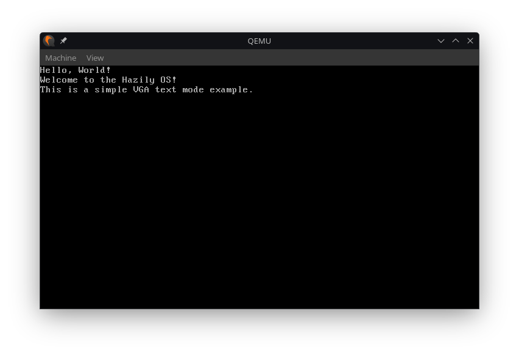

# Hazily OS
This project is my exploration into the world of OS development. Using OSDev as a guide, I am trying to create a simple OS, learn about Kernel development and deep dive into the world of low-level programming.

## Building
### Prerequisites
A cross compiler is required to build the kernel. The required packages are:
- `gcc`
- `binutils`

These need to be built for the target architecture. The target of this project is 32 bit x86, more specifically i686-elf.

#### With Make
```bash
make
```

That's it! The above command will build the kernel and create a bootable ISO image.

#### Without Make
##### Assembling boot.s
```bash
i686-elf-as -o boot.o boot.s
```


##### Compiling kernel.c
```bash
i686-elf-gcc -c kernel.c -o kernel.o -std=gnu99 -ffreestanding -O2 -Wall -Wextra
```

##### Linking
```bash
i686-elf-gcc -T linker.ld -o hazily.bin -ffreestanding -O2 -nostdlib boot.o kernel.o -lgcc
```

### Verifying the build
```bash
./verify_multiboot.sh hazily.bin
```

## Creating a bootable ISO

```bash
mkdir -p isodir/boot/grub

cp hazily.bin isodir/boot/hazily.bin
cp grub.cfg isodir/boot/grub/grub.cfg
grub-mkrescue -o hazily.iso isodir
```

## Running the OS
```bash
qemu-system-i386 -cdrom hazily.iso
```

or

```bash
./run_qemu.sh
```


